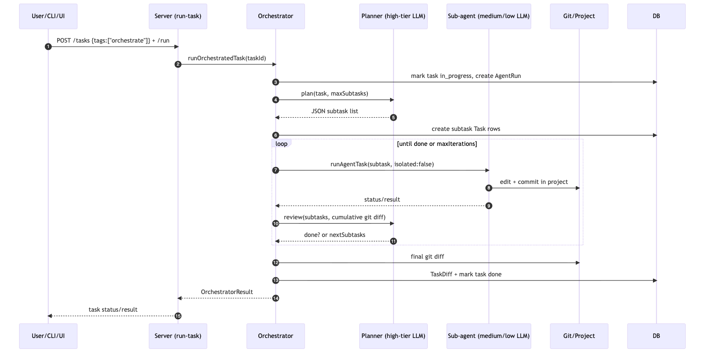
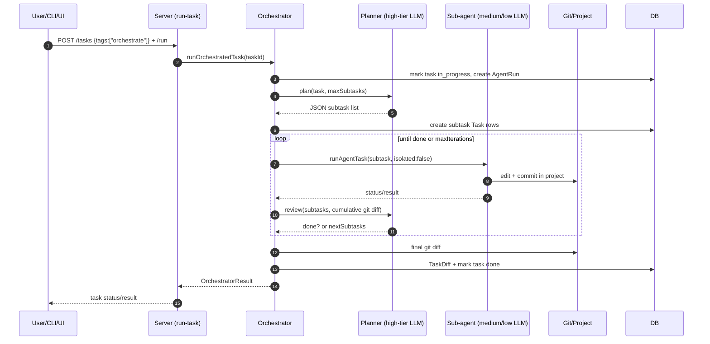
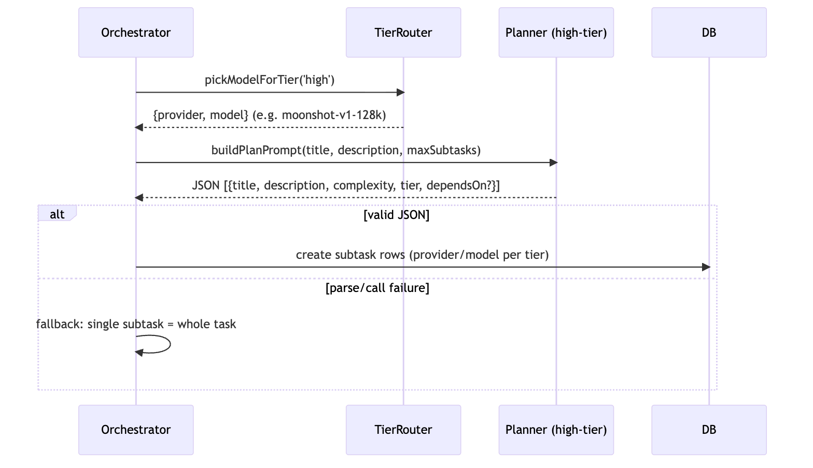
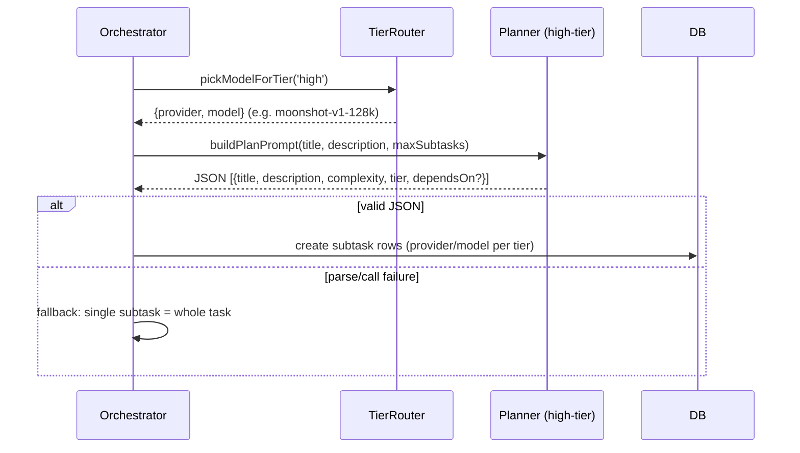
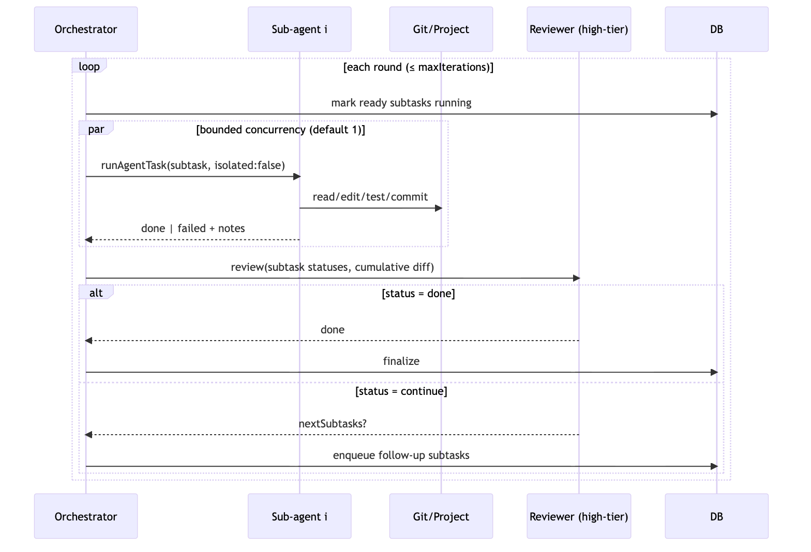
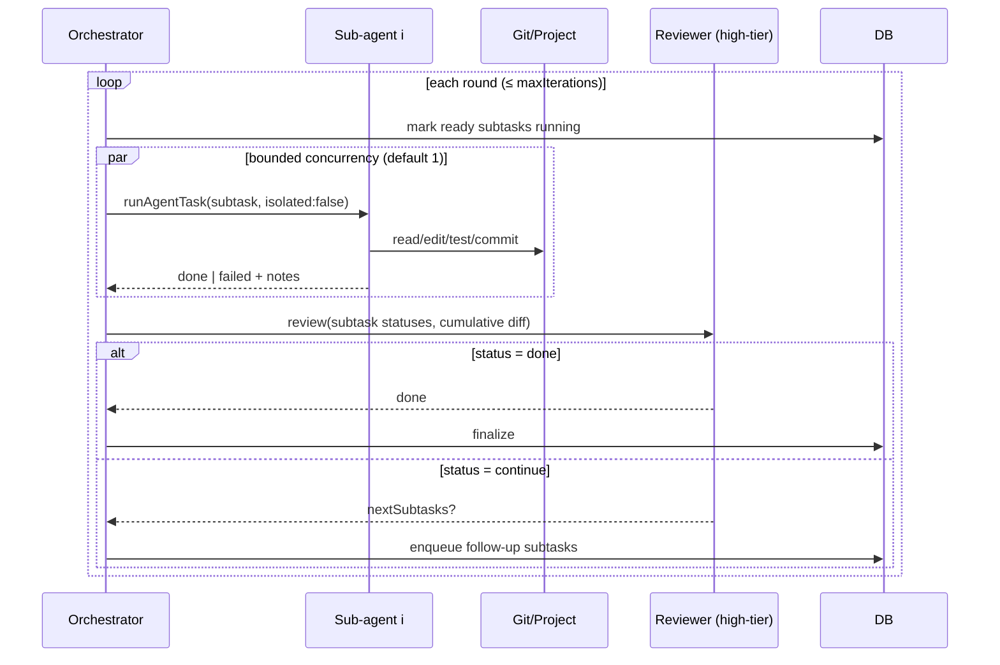
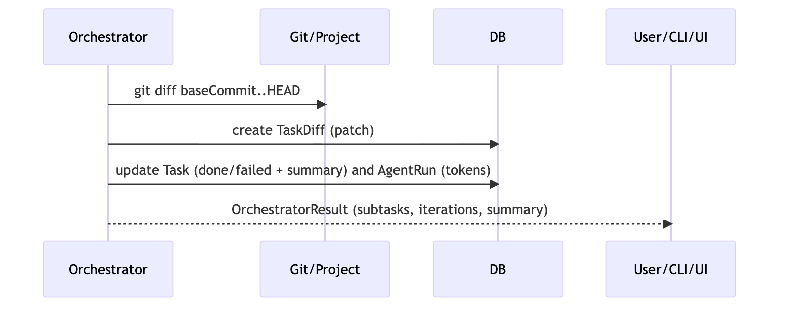
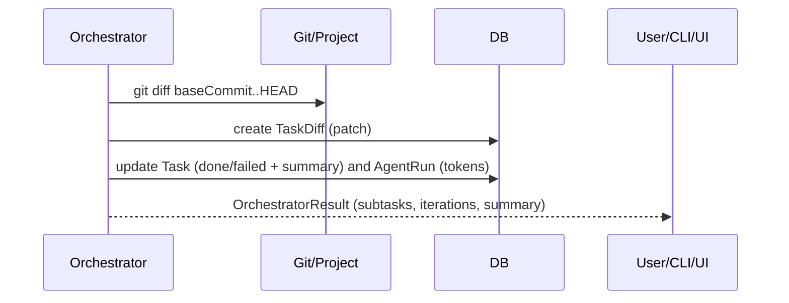

# Multi-Agent Orchestration

This document describes the Omega multi-agent orchestration system: how a
high-intelligence **orchestrator** decomposes a task, delegates implementation
to **sub-agents** running smaller models, and drives a **review/feedback loop**
until the work is complete.

---

## 1. Overview

A normal agent task runs a single agent loop against one model. An
**orchestrated** task (`tags: ["orchestrate"]`) instead runs a two-level
hierarchy:

- **Orchestrator (high tier)** — plans the task, decomposes it into concrete
  subtasks, reviews the accumulated work after each round, and decides when the
  task is done.
- **Sub-agents (medium/low tier)** — implement individual subtasks. Each runs
  the standard agent loop with a smaller, cheaper model. They execute
  **non-isolated** (directly in the project, no throwaway worktree) so their
  commits accumulate on the current branch.

The result is a single task whose diff is the composition of many small,
model-appropriate contributions, with a high-tier model acting as reviewer and
integrator.

---

## 2. Components

| Component | File | Role |
|---|---|---|
| Orchestrator | `packages/agent/src/orchestrator.ts` | Plans, delegates, reviews, integrates. |
| Agent executor | `packages/agent/src/executor.ts` | Runs a single agent loop; supports `isolated: false` for sub-agents. |
| Tier router | `packages/router/src/tiers.ts` | `pickModelForTier()` maps `high`/`medium`/`low` to a provider+model from configured capabilities. |
| Run-task routing | `apps/server/src/lib/run-task.ts` | Routes `orchestrate`-tagged tasks to the orchestrator. |
| Tracer | `packages/agent/src/tracer.ts` | Emits `orchestrator.*` spans for observability. |
| DB (Prisma/PGlite) | `packages/db/prisma/schema.prisma` | Stores tasks, subtask rows, agent runs, diffs, traces, prompt versions. |

---

## 3. Memory model

“Memory” is everything the orchestrator and sub-agents can see at each step.
It is persisted in the embedded PGlite database so runs are resumable and
inspectable.

### 3.1 Persistent memory (DB)

| Table | What it remembers |
|---|---|
| `Task` | The orchestrator task and every subtask row (title, description, complexity, provider/model, status, tags such as `subtask` and `parent:<taskId>`). |
| `AgentRun` | One row per agent/orchestrator run: branch, baseCommit, resultStatus, token usage, promptVersionId. |
| `TaskDiff` | The final integrated patch for the orchestrator task, plus each sub-agent’s diff. |
| `TaskStep` | Every tool call made by a sub-agent (input/output/error). |
| `TaskTrace` | Conversation/tool-call history per task. |
| `TraceSpan` | Structured timing spans (`orchestrator.plan`, `orchestrator.subtask.<i>`, `orchestrator.review`, `orchestrator.integrate`). |
| `PromptVersion` | The exact system/skill prompt used, hashed, so runs are reproducible. |

### 3.2 Context memory (in-flight)

- **Planner context** — task title/description, `maxSubtasks`, and (via the
  agent’s normal path) repo overview, skills, and recent project history.
- **Subtask context** — each sub-agent gets its own system prompt, repo
  overview, and skill context, but **shares the same working tree** as the
  orchestrator, so it sees prior sub-agents’ uncommitted/committed changes.
- **Review context** — the orchestrator sees the list of subtasks and their
  statuses plus the **cumulative `git diff` from the base commit**. This is
  what closes the feedback loop.

### 3.3 What sub-agents share vs. what is private

- **Shared**: the project working tree, the git branch, the accumulated diff.
  Sub-agents build on each other’s work.
- **Private**: each sub-agent’s own conversation, steps, and trace spans. The
  orchestrator only sees their status/result summary and the final diff.

---

## 4. Execution flow

### 4.1 End-to-end sequence





### 4.2 Planning phase





### 4.3 Subtask execution + review feedback loop





### 4.4 Integration





---

## 5. Model-tier routing

`pickModelForTier(prisma, tier)` reads enabled `ProviderConfig` rows and their
`capabilities` and picks:

- **high** — `advanced` capability with the largest context window
  (e.g. `moonshot-v1-128k`, `glm-5.2`). Used for planning and review.
- **medium** — `advanced` capability with a smaller context window
  (e.g. `moonshot-v1-32k`). Used for most implementation subtasks.
- **low** — `capable` capability (e.g. `moonshot-v1-8k`). Used for
  mechanical/trivial subtasks.

If nothing matches, it falls back to the provider’s `defaultModel`.

The planner may assign a subtask `"tier": "medium"` or `"low"`; the
orchestrator resolves that to a concrete provider/model when the subtask row is
created.

---

## 6. Configuration knobs

`runOrchestratedTask(prisma, taskId, options)` accepts:

| Option | Default | Meaning |
|---|---|---|
| `maxSubtasks` | 5 | Max subtasks the planner may create up front. |
| `maxIterations` | 3 | Max plan/review feedback-loop rounds. |
| `concurrency` | 1 | How many sub-agents run in parallel. |
| `tokenBudget` | unset | Per-run token cap forwarded to sub-agents. |

These can be surfaced through the CLI/UI later; for now they are set by the
caller.

---

## 7. API usage

```bash
# 1. Create the orchestrated task
curl -X POST http://localhost:4000/tasks \
  -H 'Content-Type: application/json' \
  -d '{
    "projectId": "<project-id>",
    "title": "Add string utils and CLI",
    "description": "Create src/strings.js exporting capitalize(str), and cli.js that prints capitalize(\"hello omega\"). Update test.js to assert capitalize(\"hELLO\") === \"Hello\" and run the test.",
    "complexity": "medium",
    "tags": ["orchestrate"]
  }'

# 2. Run it
curl -X POST http://localhost:4000/tasks/<task-id>/run
```

Subtasks appear as normal tasks tagged `subtask` and `parent:<taskId>`, so the
existing task board, trace views, and SSE streams work for them too.

---

## 8. Observability

- **Spans** — `orchestrator.task`, `orchestrator.plan`,
  `orchestrator.subtask.<i>`, `orchestrator.review`, `orchestrator.integrate`.
  Visible in the task’s trace flow and analysis panels.
- **Subtask rows** — each sub-agent’s steps, traces, diffs, and agent run are
  queryable via the existing `/tasks/:id/*` endpoints.
- **Live stream** — `GET /tasks/:id/stream` emits orchestrator and subtask
  updates as they happen.

---

## 9. Verification, escalation, and the learning loop

- **Review-with-verification** — before the reviewer may mark a task `done`, the orchestrator runs the project’s build/test command (`validateProject`) and includes the result in the review. A failing build/test forces `continue`.
- **Model escalation** — a failed subtask is retried on a higher model tier (`low → medium → high`) up to `maxEscalations` times (default 1). Each attempt is a separate span (`orchestrator.subtask.<i>.attempt<n>`).
- **Skill auto-generation** — when an orchestrated task completes successfully, the final diff is saved as a reusable skill (`auto-<slug>`) in the skills directory and the `SkillArtifact` table (skipped for benchmark tasks).
- **Memory recall** — the planner recalls up to 3 relevant past skills/patterns (matched by task-description keywords) and includes them in the planning prompt so the orchestrator reuses what worked before.

## 10. Failure and fallback semantics

- **Planner failure** — if the planning call or JSON parse fails, the
  orchestrator falls back to a single subtask that wraps the whole task.
- **Subtask failure** — recorded as `failed` with notes; the round continues.
  If every subtask fails and review adds nothing, the task stops.
- **Review failure** — treated as `continue` so the loop keeps making progress
  rather than aborting.
- **Stalled dependencies** — if pending subtasks have unsatisfiable
  dependencies, the task ends with a summary.

---

## 11. Current limitations and next steps

- **Sequential by default** — `concurrency: 1` keeps commits linear and avoids
  merge conflicts. Raising concurrency runs sub-agents in parallel in the same
  working tree, which is only safe for truly independent subtasks.
- **Shared working tree** — sub-agents see each other’s changes immediately;
  there is no per-subtask isolation. Conflicting edits are possible with
  concurrency > 1.
- **No automated conflict resolution** — integration is “last commit wins”
  because sub-agents commit sequentially on one branch.
- **Token cost** — planning + review on a high-tier model plus N sub-agents is
  more expensive than a single agent; use `maxSubtasks`/`maxIterations`/
  `tokenBudget` to control it.

Possible next steps:

- Expose `maxSubtasks`/`maxIterations`/`concurrency` in the CLI and web UI.
- Optional isolated sub-agents with a merge step for safer parallelism.
- Persist the planner’s JSON plan as a first-class artifact for audit.
- Let the review step run the project’s build/test command before deciding
  `done`.
